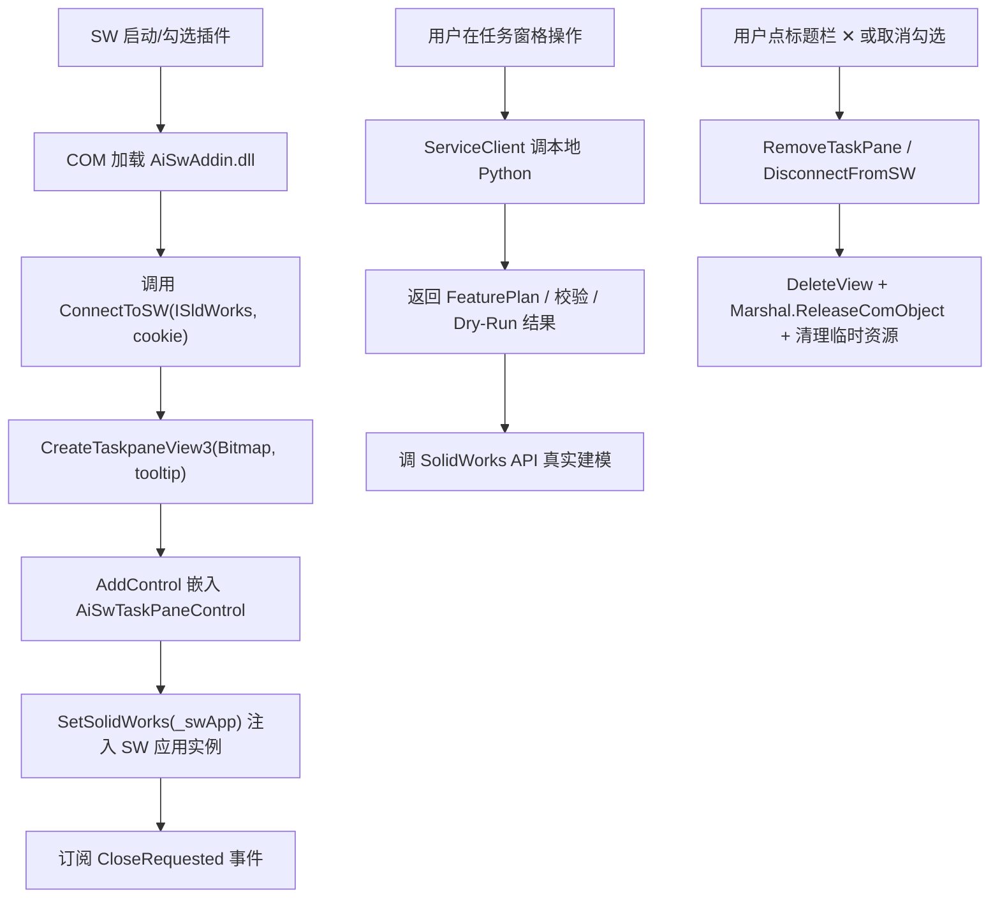

# SolidWorks 插件（AiSwAddin）架构总结

本文档梳理当前 SolidWorks 端插件的整体结构、模块职责、关键 API、UI 组成、构建/调试流程与后续扩展点，作为长期参考。

> 相关代码目录：[`plugin/AiSwAddin/`](../../plugin/AiSwAddin/)
> 相关 Python 服务：[`service/`](../../service/) 与 [`app/`](../../app/)

---

## 1. 定位与职责边界

采用 **「插件仅负责 UI 与 SolidWorks 集成，业务逻辑放本地 Python HTTP 服务」** 的方案：

- **插件（C# / .NET Framework 4.7.2 / WinForms）**
  - 以 COM 加载到 SolidWorks 进程内
  - 创建右侧任务窗格 UI（`ITaskpaneView`）
  - 通过 `ServiceClient` 调用本地 Python 服务
  - 将 AI 生成的 `FeaturePlan` 落到 SolidWorks 建模操作上
- **Python 本地服务（`service/http_service.py`）**
  - 承载 LLM 调用、意图解析、`FeaturePlan` 生成、Policy 校验、Dry-Run
  - 暴露 HTTP 端口（默认 `http://127.0.0.1:8765`）
  - 通过 `start_service.bat` 启动

这样保证：C# 侧不引入重量级依赖，业务算法演化在 Python 侧闭环。

---

## 2. 目录与文件结构

```
plugin/AiSwAddin/
├── AiSwAddin.csproj          # 项目文件（.NET Framework 4.7.2）
├── AiSwAddin.cs              # ISwAddin 主类：COM 注册、任务窗格生命周期
├── AiSwTaskPaneControl.cs    # WinForms UserControl：完整 UI + 业务流程
├── UiHelpers.cs              # 主题色、自绘控件（HeaderPanel/CardPanel/FeatureCard 等）
├── ServiceClient.cs          # HTTP 客户端：调用 Python 本地服务
├── Program.cs                # 预览入口（WinExe 模式），仅调试 UI 用
└── Properties/AssemblyInfo.cs
```

`.csproj` 关键配置：

- `OutputType`
  - `Library` = 生成 `AiSwAddin.dll` 供 SolidWorks 加载（**发布用**）
  - `WinExe` = 生成可运行 EXE，配合 `Program.cs` 做 UI 快速预览（**调试用**，发布前需切回）
- `RegisterForComInterop=true`：编译时自动 `RegAsm` 注册 COM
- `TargetFrameworkVersion=v4.7.2`：SW 2019/2022 都兼容；SW 2024 需升到 4.8
- `Prefer32Bit=false + AnyCPU`：SolidWorks 是 64 位进程

---

## 3. 加载流程（SolidWorks ↔ 插件）



关键回调：

- `ConnectToSW`：SW 加载时唯一入口；此处 `SetAddinCallbackInfo2` 让 SW 知道回调对象，再创建任务窗格。发生异常会弹 MessageBox（避免静默失败）。
- `DisconnectFromSW`：SW 卸载/关闭时释放所有 COM 引用与 GDI 资源。

---

## 4. UI 层：`AiSwTaskPaneControl`

WinForms UserControl，用一个 `TableLayoutPanel`（`Dock=Top + AutoSize`）作为主容器，自上而下 7 行：

| 行 | 高度 | 组件 | 说明 |
|---|---|---|---|
| 0 | 62px | `HeaderPanel` | 蓝绿渐变标题栏 + 全自绘 Logo/版本徽章/关闭 ✕ |
| 1 | 52px | 模式行 | `ModePillButton`（企业协同/离线本地切换）+ 三个 `BadgeLabel` |
| 2 | 88px | 功能卡片 | 三张 `FeatureCard`（3D 建模 / 3D 转 2D / 上传云平台）等分排列 |
| 3 | 90px | 就绪信息卡 | `CardPanel` + 主副标题 |
| 4 | 动态 | 日志区 | `CardPanel` 内 `TextBox`，随窗口高度自适应 |
| 5 | 180px | 输入卡 | 多行输入 + 附件标签 + `RoundButton`「➤ 发送」 |
| 6 | 40px | 任务中心栏 | 底部状态条（展示性） |

**自适应策略**：主容器 `AutoSize`，`AdjustRootHeight` 在 `Resize` 时动态改日志区高度，高度不足时外层 `AutoScroll` 兜底出现滚动条 — 内容永远不被裁切。

### 自定义控件（[`UiHelpers.cs`](../../plugin/AiSwAddin/UiHelpers.cs)）

- `Theme` — 集中管理主题色/字体（蓝紫渐变、圆角、YaHei 字体等）
- `GfxUtil.RoundedRect` — 圆角矩形路径工具
- `HeaderPanel` — 顶部渐变标题栏，全自绘（图标/文字/✕ 按钮）+ `CloseClicked` 事件
- `CardPanel` — 通用圆角卡片（支持选中态边框），用 `PixelOffsetMode.Half` 保证边框不缺
- `FeatureCard` — **全自绘功能卡片**：图标 + 文字 + 边框一次性画，杜绝子控件覆盖底边框问题。支持 `Selected` 状态切换与自绘 3D 立方体 (`DrawCubeIcon`)
- `BadgeLabel` — 圆角描边小徽章（GB 标准号等）
- `RoundButton` — 圆角实心/描边按钮（发送按钮）
- `ModePillButton` + `ModeDropdownForm` — 药丸型模式选择器 + 弹出菜单

---

## 5. 业务流程：生成 → 校验 → 预演 → 执行

由 `AiSwTaskPaneControl.OnSendClick` 串起，与「新建 3D 零件」卡片共用逻辑（`OnGenerateClick` → `OnSendClick`）：

```
用户输入需求
    ↓
GeneratePlanAsync   → POST /generate_plan  → 返回 FeaturePlan JSON
    ↓
ValidateAsync       → POST /validate       → Policy 规则校验
    ↓
DryRunAsync         → POST /dry_run        → 生成执行计划(不改模型)
    ↓
【PlanReviewPanel 展示步骤 + 等用户审阅】
    ├─ 点「✎ 修改计划」 → 回到就绪态,允许用户改 prompt 后重发
    └─ 点「▶ 确认并执行」 → ↓
ExecuteAsync        → POST /execute        → 通过 pywin32 驱动 SolidWorks 真建模
```

每一步失败即中断并写入日志区。SetBusy 期间禁用发送按钮和 3D 建模卡，避免重复点击。

**PlanReviewPanel（[`UiHelpers.cs`](../../plugin/AiSwAddin/UiHelpers.cs)）** 是可视化审阅面板：预演通过后 UI 从"就绪态"切到"步骤态"，从 FeaturePlan 的 `operations` 数组中提取每步的中文名、SolidWorks API 名、参数描述，让用户在真正调 SolidWorks API 前先确认。此设计替代了早期"MessageBox 是/否"的简陋确认方式。

---

## 6. 服务通信层：`ServiceClient`

- 封装 `HttpClient`，基地址 `http://127.0.0.1:8765`
- 提供 4 个方法：`GeneratePlanAsync` / `ValidateAsync` / `DryRunAsync` / `ExecuteAsync`
- 返回原始 JSON 字符串，UI 侧用轻量 `ExtractPlanJson` 提取 plan 段——**故意不引入 Newtonsoft**，减小 DLL 体积与依赖冲突

---

## 7. 关键 SolidWorks API

当前使用的 API（都属 SW 2015+ 稳定接口）：

| API | 用途 |
|---|---|
| `ISldWorks.SetAddinCallbackInfo2` | 注册插件回调 |
| `ISldWorks.CreateTaskpaneView3(Bitmap,tip)` | **创建任务窗格 + 透明图标**（优先使用） |
| `ISldWorks.CreateTaskpaneView2(bmpPath,tip)` | 老版本回退方案 |
| `ITaskpaneView.AddControl(progId,cookie)` | 把 UserControl 嵌入窗格 |
| `ITaskpaneView.DeleteView` | 关闭窗格 |

**任务窗格图标**：`BuildTaskPaneBitmap()` 用 GDI+ 动态绘制 24×24 蓝紫渐变圆角 + ✦ Logo，`Format32bppArgb` 支持透明。位图存到字段 `_iconBitmap`（生命周期到卸载），插件卸载时才 Dispose，避免 SW 侧引用被提前释放。

---

## 8. COM 注册

`[ComRegisterFunction]` / `[ComUnregisterFunction]` 静态方法在 `RegAsm` 执行时被调用，写入两处注册表：

- `HKLM\SOFTWARE\SolidWorks\Addins\{GUID}` — 插件描述与默认加载标志
- `HKCU\SOFTWARE\SolidWorks\AddInsStartup\{GUID}` — 启动时自动加载

`.csproj` 里 `<RegisterForComInterop>true</RegisterForComInterop>` 让 VS 在 Build 后自动调 RegAsm。首次注册需以**管理员身份**运行 VS。

---

## 9. 构建与调试

**发布模式**（生成插件 DLL）：
1. `.csproj` 里 `OutputType` 保持 `Library`（默认），注释掉 `StartupObject`
2. VS 以管理员运行 → Rebuild → 得到 `bin\Debug\AiSwAddin.dll` 并自动注册 COM
3. 打开 SW → 工具 → 插件 → 勾选「AI-SW 智能建模」→ 任务窗格出现

**UI 快速预览**（不启动 SW，秒开窗体调布局）：
1. 临时把 `.csproj` 的 `OutputType` 改为 `WinExe`，设置 `StartupObject=AiSwAddin.Program`
2. F5 → 弹出预览窗体（`Program.cs`，控件 `Dock=Fill` 随窗体自由缩放）
3. **发布前必须改回 `Library`**

**代码修改后重新加载**：SW 里先取消勾选（释放 DLL 占用）→ VS Rebuild → SW 里重新勾选。

### ⚠️ 排查易踩坑（改动后为何"看起来没生效"）

C# 插件和 Python 服务是两个独立进程，修改后各自需要**独立的刷新动作**。任一环节忘做，都会跑旧代码：

| 修改了哪些文件 | 必须做什么才生效 |
|---|---|
| `plugin/AiSwAddin/**/*.cs`、`*.csproj` | ① SW 里取消勾选本插件 ② VS Rebuild ③ SW 里重新勾选 |
| `service/**`、`app/**`、`src/**`（Python 侧） | 关闭 `start_service.bat` 窗口 → 重新双击运行 |
| 两侧都改了 | 两条都要做 |

**判断"是哪边没刷新"的小技巧**：
- 报错文案是**新版本的**（比如你刚改的错误信息） → C# 已生效
- 报错文案是**旧版本的**（代码里 grep 找不到那句话） → Python 服务没重启
- 反之亦然

**其它常见坑**：
- SW 里勾选插件后**没反应/没弹任务窗格** → `ConnectToSW` 抛异常被 SW 静默吞掉；本插件已加 `try/catch + MessageBox` 兜底，会弹错误框显示具体异常
- 建模第一次成功、第二次报"未检测到 SolidWorks" → COM 多线程问题；参见 §12
- 建模成功但 SolidWorks 完成后闪退 → 同 §12，工作线程未串行化 COM 调用


---

## 10. 会话管理（临时方案：本地 JSON 文件）

> 相关代码：[`service/session_store.py`](../../service/session_store.py)、[`service/http_service.py`](../../service/http_service.py)

### 10.1 需求

1. **上下文连续** — 同一会话内多轮对话，后续生成计划时把历史送给 LLM。
2. **跨进程持久化** — 重开 SolidWorks / 插件后能找回历史对话。
3. **任务中心** — 底部任务栏"任务中心"展示最近 3 个会话。

### 10.2 为什么先不上数据库

经评估选择**本地 JSON 文件**方案，不引入数据库。决策依据（五个维度）：

| 维度 | 现状 | 结论 |
|---|---|---|
| 用户规模 | 单机单用户（插件跑在个人 SW 进程内） | 无并发写竞争压力 |
| 数据量 | 一年至多数千条会话 | 文件足够，无需索引引擎 |
| 查询模式 | 仅"最近 N 条列表" + "按 id 打开" | 无复杂关联/聚合查询 |
| 部署环境 | 客户内网离线，禁装第三方包 | 纯标准库最稳妥（见离线约束备忘） |
| 演进成本 | 未来若需全文检索再迁移 | JSON→SQLite 迁移路径清晰（见 §10.6） |

### 10.3 存储结构

```
workspace/sessions/
├── index.json                  # 会话索引：最近列表快速读取，无需扫全部文件
└── <session_id>.json           # 单个会话完整记录
```

- `session_id` 形如 `20260814_225352_a1b2`（时间戳 + uuid4 前 4 位）
- **单会话文件**：`id / title / status(active|done|failed) / started_at / updated_at / messages[] / context{}`
- **index.json**：`{"sessions":[{id,title,status,started_at,updated_at}]}`，按 `updated_at` 倒序

### 10.4 SessionStore API（[`session_store.py`](../../service/session_store.py)）

进程内单例 `get_session_store()`，对外方法：

| 方法 | 说明 |
|---|---|
| `create_session(title="", first_message=None)` | 新建会话，返回 session_id |
| `append_message(session_id, message)` | 追加一条消息（首条用户消息可自动派生标题） |
| `set_status(session_id, status)` | 置状态（非法值回落 active） |
| `set_context(session_id, key, value)` | 写上下文（如 `last_plan`） |
| `load(session_id)` | 读完整会话 |
| `list_recent(limit=3)` | 最近 N 条摘要（供任务中心） |
| `get_messages(session_id)` | 取消息列表（供上下文回放） |

**三项可靠性保证**：
- **线程安全** — 服务是 `ThreadingHTTPServer`，用一把 `RLock` 串行化读写。
- **原子写盘** — 先写 `.tmp` 再 `os.replace`，防写入中途崩溃损坏文件。
- **防路径穿越** — `session_id` 只保留字母/数字/`_`/`-`，阻断 `../../` 攻击。

### 10.5 HTTP 接口与上下文注入

**接口清单**（基地址 `http://127.0.0.1:8765`）：

| 方法 | 路由 | 用途 |
|---|---|---|
| GET | `/api/sessions/recent?n=3` | 任务中心"最近会话"列表 |
| GET | `/api/sessions/<id>` | 打开插件时恢复该会话完整对话 |
| POST | `/api/sessions/create` | 新建会话 |
| POST | `/api/sessions/append` | 追加消息 |
| POST | `/api/sessions/status` | 更新状态 |

**上下文注入策略**（[`_build_prompt_with_history`](../../service/http_service.py:183)）：
`/api/generate_plan` 接受可选 `session_id`。因 `parse_featureplan_with_provider` 只接受单字符串，故在 HTTP 层把最近 **12 条消息（约 6 轮）** 组织成"用户/助手"对话前缀嵌入 prompt——既保证上下文连续，又不改动核心解析签名。生成成功后自动 `append_message`（用户输入 + AI 计划摘要）并 `set_context('last_plan')`。

### 10.6 后续优化方案

- **排序稳定性（已修复）** — `_now_iso()` 仅到秒级，高频操作同秒内 `sort` 不稳定；已加进程内单调序号 `_seq` 作次级排序键 `(updated_at, _seq)`，对外返回时过滤 `_seq`。后续可把时间戳升级到毫秒或改用单调时钟进一步弱化对 `_seq` 的依赖。
- **迁移 SQLite 的触发条件** — 出现以下任一情形即应迁移：① 需按内容做**全文检索**；② 需**跨零件/跨会话关联查询**；③ 数据量上万导致 `index.json` 全量读写变慢；④ 出现**多用户并发**写入。
- **迁移路径** — SessionStore 已把存储细节封装在类内，对外 API 不变；迁移时只需替换内部读写实现（JSON 文件 → sqlite3，仍属标准库，契合离线约束），HTTP 层与插件端无感。
- **上下文注入优化** — 当前固定截取最近 12 条，未来可做 **token 预算裁剪**（按长度动态取轮数），避免长对话下 prompt 超限。

### 10.7 待接入（插件端，下一阶段）

服务端已就绪，插件端尚待：① `ServiceClient` 增加 session 相关方法；② 任务中心接入真实"最近会话"数据（当前为展示性 UI）；③ 打开插件时按 `session_id` 恢复历史对话。

---

## 11. 后续扩展点

现有 UI 已经为几个业务功能预留了入口，但只有「新建 3D 零件」接入了真实流程：

- **3D 转 2D 出图**（第二张卡片）→ 可调 `IDrawingDoc.Create3rdAngleViews2` 一键三视图，接入现有生成/校验/执行流程
- **上传云平台**（第三张卡片）→ 可扩展为 REST 上传 SLDPRT/PDF 到公司平台
- **模式切换**（企业协同 vs 离线本地）→ 已经有 UI，可用于选择 LLM Provider（在线云 vs `local` 服务）
- **附件 / 指令**（输入卡底部）→ 可加图片附件、slash 指令等

新增业务功能的推荐方式：
1. 在 `ServiceClient` 加对应 HTTP 方法
2. 在 `AiSwTaskPaneControl` 加 `async` 处理函数，走「生成 → 校验 → 预演 → 执行」四段
3. 在 Python 服务侧实现对应 endpoint 与 FeaturePlan 类型
4. UI 层只做点击绑定与日志展示，不承载业务逻辑

---

## 12. 已知限制与注意事项

- **`_targetBox` 字段目前恒为 null**，`ExecuteAsync` 里读它只做安全判断，永远走"新建零件"分支。若要恢复"当前文档"选项，需在 UI 里重新加入目标下拉框
- **任务窗格宽度固定约 400px**：UI 中大量元素按 400 宽设计（如标题栏 Logo 位置），拉宽窗体后仍能正确渲染（已在自绘中处理），但视觉上会显得空
- **预览 EXE 里点关闭 ✕ 无效**：因为没有宿主订阅 `CloseRequested` 事件，行为符合预期
- **SW 版本升级**（如换到 2022）：需要在 VS 里重新指定三个 `SolidWorks.Interop.*` 引用到新版 `api\redist` 目录，然后以管理员 Rebuild 重新注册 COM。代码本身无需改

---

## 13. COM 线程模型与 SW 闪退防护

**踩过的两个坑（都由多线程 COM 引起）：**

1. **第一次执行成功、第二次报"未检测到 SolidWorks"** — HTTP 服务是 `ThreadingHTTPServer`，每次请求可能被分到不同线程。Python 的 pywin32 在使用 COM 前需要在**每个线程**先调 `pythoncom.CoInitialize()`，否则新线程里 `GetActiveObject("SldWorks.Application")` 会失败。
2. **建模成功后 SolidWorks 主进程闪退** — 更严重的问题：COM 对象绑定在**创建它的线程的 apartment**，跨线程使用会引起状态紊乱，甚至把宿主 SW 一并搞崩。

**根治方案（[`service/sw_worker.py`](../../service/sw_worker.py)）：** `SolidWorksWorker` 单例——一个 daemon 线程，启动时 `pythoncom.CoInitialize()` 一次；所有 SW 相关请求(`/api/execute`)都通过 `queue.Queue` 提交给它串行处理。这样：
- 所有 SW COM 调用永远在同一个 STA 线程里
- HTTP 请求线程只是 `worker.submit(fn)` 阻塞等结果，不接触任何 COM
- `SolidWorksSession` 单例(`_shared_session`) 只在 worker 线程访问，避免每次请求重连

**部署后的表现：** 连续多次执行建模不再失败、SW 不再闪退。

---

## 14. 智能选择目标窗口

**需求：** 用户连续多次调「新建 3D 零件」时，第一次可以复用 SW 里的空零件窗口，之后每次应新开一个窗口，不要在已有零件上叠加特征。

**实现（[`ModelBuilder`](../../src/solidworks_api/model_builder.py)）：**
- `_pick_target_doc(sw_app, use_active_doc)`：`use_active_doc=True` 时优先看 `sw_app.ActiveDoc`——若是"空零件"则复用，否则返回 None 让流程走新建
- `_is_empty_part(doc)`：判定条件 = 文档类型为 `swDocPART` **且** 顶层 Feature 遍历后仅含默认基准面/原点（同时兼容中英文名："Front Plane" / "前视基准面" 等）
- C# 侧 [`ExecuteAsync`](../../plugin/AiSwAddin/AiSwTaskPaneControl.cs) 固定传 `useActiveDoc=true`，让服务端自动决策

**行为矩阵：**

| SW 当前状态 | 结果 |
|---|---|
| 无活动文档 | 新建零件窗口 |
| 空零件（只有基准面/原点） | 复用当前窗口 |
| 已有实际零件（有用户特征） | 自动新开窗口，不叠加 |
| 打开的是装配/工程图 | 视为"非零件"，新开零件窗口 |
